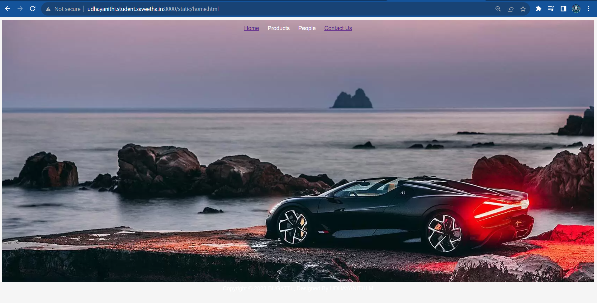
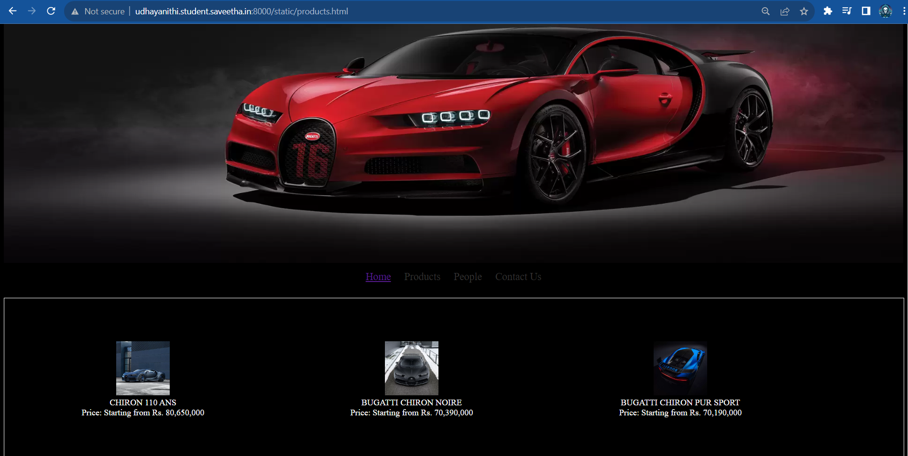
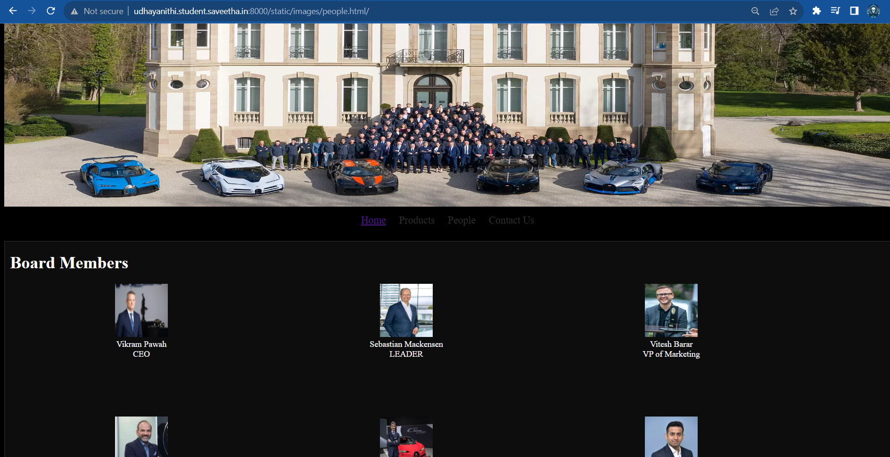
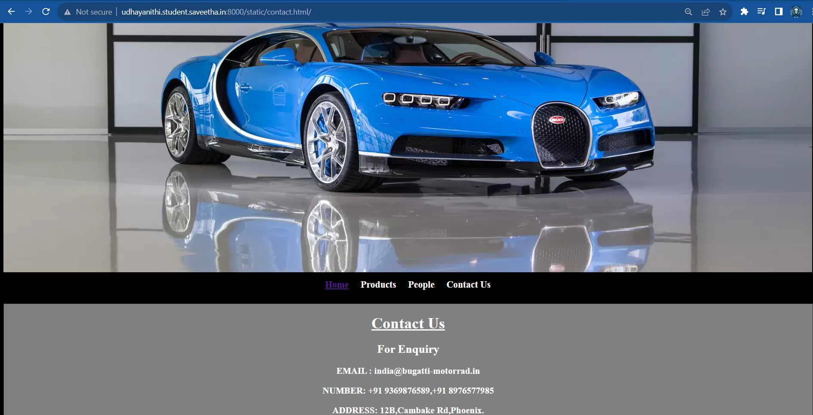
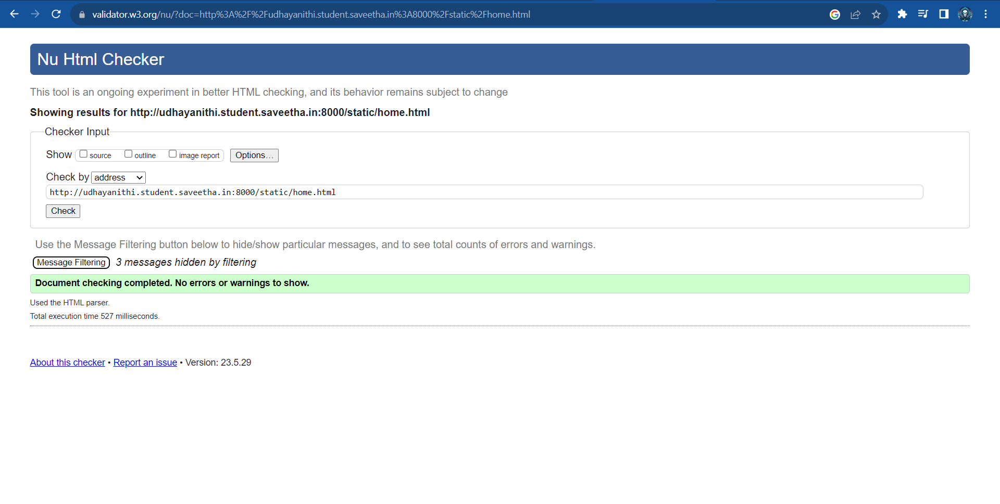

# Web Design for a Software Product Company

## AIM:

To design a static website for a software product company company.

## DESIGN STEPS:

### Step 1:

Requirement collection.

### Step 2:

Creating the layout using HTML and CSS.

### Step 3:

Updating the sample content.

### Step 4:

Choose the appropriate style and color scheme.

### Step 5:

Validate the layout in various browsers.

### Step 6:

Validate the HTML code.

### Step 6:

Publish the website in the given URL.

## PROGRAM :
```
home.html
 <!DOCTYPE html>
<html lang="en">

<head>
    <title>BUGATTI</title>
    <link rel="stylesheet" href="./css/layout.css" />
    <link rel="icon" href="./html/icon.png" type="image/x-icon" />
</head>

<body>
    <div class="container">
        <div class="menu">
            <div class="menuitemselected"><a href="/static/home.html">Home</a></div>
            <div class="menuitem"><a href="/static/products.html">Products</a></div>
            <div class="menuitem"><a href="/static/images/people.html">People</a></div>
            <div class="menuitemselected"><a href="/static/contact.html">Contact Us</a></div>
        </div>
        </div>
        <div class="footer">
         Copyright &#169; 2023 BUGATTI , Designed By UDHAYANITHI M
      </div>

</body>

</html>

product.html
<!DOCTYPE html>
<html lang="en">
  <head>
    <title>BUGATTI</title>
    <link rel="stylesheet" href="/static/css/lay1.css" />
    <link rel="icon" href="/static/images/logopp.png" type="image/x-icon" />
  </head>

  <body>
    <div class="container">
      <div class="banner"></div>
      <div class="menu">
        <div class="menuitemselected"><a href="/static/home.html/">Home</a></div>
        <div class="menuitem"><a href="/static/products.html/">Products</a></div>
        <div class="menuitem"><a href="/static/images/people.html/">People</a></div>
        <div class="menuitem"><a href="/static/contact.html/">Contact Us</a></div>
     
      </div>
      
      <div class="content">
        <div class="productcontent">
            <h1 class="hrr">BUGATTI</h1>
          <div class="productitems">
              <div class="productitem"> 
                  <div class="itemimage">
                  
                  </div>
                  <div class="itemname">CHIRON 110 ANS</div>
                  <div class="itemprice">Price: Starting from Rs. 80,650,000 </div>
              </div>
              <div class="productitem"> 
                  <div class="itemimage">
                  
                  </div>
                  <div class="itemname">BUGATTI CHIRON NOIRE</div>
                  <div class="itemprice">Price: Starting from Rs. 70,390,000 </div>
              </div>

              <div class="productitem"> 
                <div class="itemimage">
                
                </div>
                <div class="itemname">BUGATTI CHIRON PUR SPORT</div>
                <div class="itemprice">Price: Starting from Rs. 70,190,000</div>
              </div><div class="productitem"> 
                  <div class="itemimage">
                  
                  </div>
                  <div class="itemname">BUGATTI CHIRON</div>
                  <div class="itemprice">Price: Starting from Rs. 60,890,000  </div>
              </div>
              <div class="productitem"> 
                <div class="itemimage">
                
                </div>
                <div class="itemname">BUGATTI CHIRON SUPER SPORT</div>
                <div class="itemprice">Price: Starting from Rs.80,920,000 </div>
              </div>
              <div class="productitem"> 
                <div class="itemimage">
                
                </div>
                <div class="itemname">BUGATTI CHIRON " LES LEGENDS DU CIEL"</div>
                <div class="itemprice">Price: Starting from Rs.90,350,000 </div>
              </div>
          </div>
          </div>        
          
        
      <div class="footer">
        Copyright &#169; 2023 BUGATTI , Designed By UDHAYANITHI M
      </div>
    </div>
  </body>
</html>

people.html
<!DOCTYPE html>
<html lang="en">
  <head>
    <title>BMW</title>
    <link rel="stylesheet" href="/static/css/lay3.css" />
  </head>

  <body>
    <div class="container">
      <div class="banner"></div>
      <div class="menu">
        <div class="menuitemselected"><a href="/static/home.html/">Home</a></div>
        <div class="menuitem"><a href="/static/products.html/">Products</a></div>
        <div class="menuitem"><a href="/static/images/people.html/">People</a></div>
        <div class="menuitem"><a href="/static/contact.html/">Contact Us</a></div>
     
      </div>
      <div class="content">
        <div class="productcontent">    
          <h1>Board Members</h1>
          <div class="productitem"> 
          <div class="itemimage">
          
          </div>
          <div class="itemname">Vikram Pawah</div>
          <div class="itemprice">CEO</div>
        </div>
        <div class="productitem"> 
          <div class="itemimage">
          
          </div>
          <div class="itemname">Sebastian Mackensen</div>
          <div class="itemprice">LEADER</div>
        </div>
        <div class="productitem"> 
          <div class="itemimage">
          
          </div>
          <div class="itemname">Vitesh Barar</div>
          <div class="itemprice">VP of Marketing</div>
        </div>
        <div class="productitem"> 
          <div class="itemimage">
          
          </div>
          <div class="itemname">Balasubramani Shanmugam</div>
          <div class="itemprice">Cheif Architect</div>
      </div>
      <div class="productitem"> 
        <div class="itemimage">
        
        </div>
        <div class="itemname">Manchit Handa</div>
        <div class="itemprice">Project Manager</div>
      </div>
      <div class="productitem"> 
      <div class="itemimage">
      
      </div>
      <div class="itemname">Dhawal Makwana</div>
      <div class="itemprice">Technical Lead</div>
      </div>
      </div>
        </div>
      <div class="footer">
        Copyright &#169; 2023 BMW , Designed By DHANUSH P
    </div>    
      </div>
    </div>
  </body>
</html>

contact.html
<!DOCTYPE html>
<html lang="en">
  <head>
    <title>BUGATTI</title>
    <link rel="stylesheet" href="/static/css/lay2.css" />

  </head>

  <body>
    <div class="container">
      <div class="banner"></div>
      <div class="menu">
         <div class="menuitemselected"><a href="/static/home.html/"><b>Home</b></a></div>
        <div class="menuitem"><a href="/static/products.html/"><b>Products</b></a></div>
        <div class="menuitem"><a href="/static/images/people.html/"><b>People</b></a></div>
        <div class="menuitem"><a href="/static/contact.html/"><b>Contact Us</b></a></div>
      </div>
      <div class="content">
          <div class="us">
              <h1>
                  <u>Contact Us</u>
                </h1>
                <h2>For Enquiry</h2>
                        <h3>EMAIL : india@bugatti-motorrad.in</h3>
                        <h3>NUMBER: +91 9369876589,+91 8976577985</h3>
                        <h3>ADDRESS: 12B,Cambake Rd,Phoenix.</h3>
                        <h3>WEBSITE: www.bugatti.com</h3>
          </div>
            </div>
            <div class="footer">
        Copyright &#169; 2023 BUGATTI , Designed By UDHAYANITHI M
      </div>
    </div>
  </body>
</html>

lay1.css
<style>
* {
  box-sizing: border-box;
  font-family: Arial, Helvetica, sans-serif;
}
body {
  background-color:black;
  color:black;
}
.container {
  
  
}

.banner {
  display: block;
  width: 100%;
  height: 450px;
  text-align: center;
  font-size: 10px;
  font-weight: bold;
  background-image: url(https://www.bugatti.com/fileadmin/_processed_/sei/p121/se-image-6fa5352a1e8c618c5e4137867f6d62e1.webp);
  background-size: 100% 100%;
  margin: 0px 0px 0px 0px;
  padding-top: 150px;
}
h1{
    text-align: center;
}
h2{
    text-align: center;
}
h3{
    text-align: center;
}


.menu {
  display: block;
  width: 100%;
  height: 50px;
  font-size: larger;
  background-color:black;
  text-align: center;
  padding-top: 15px;
  margin: 0px 0px 0px 0px;
  border-width: 1px;
}

.menuitem {
  display: inline-block;
  margin-left: 10px;
  margin-right: 10px;
}
.menuitemselected {
  display: inline-block;
  margin-left: 10px;
  margin-right: 10px;
  
}

.menuitem a {
  text-decoration:none;
  color: rgb(51, 50, 50);
}


.content {
  display: block;
  width: 100%;
  background-color: bla;
  min-height: 500px;
  margin: 0px 0px 0px 0px;
  border-width: 1px;
  border-color:white;
  border-style: solid;
}
.homecontent {
  min-height: 500px;
  margin: 10px 10px 10px 10px;
}
.homecontent h1 {
  text-align: left;
  font-family: Arial, Helvetica, sans-serif;
}
.homecontent img {
  float: right;
  width: 400px;
  height: 300px;
  margin-left: 10px;
}

.contenttext {
  text-align: justify;
  color:gray;
}

.productcontent {
  min-height: 500px;
  margin: 10px 10px 10px 10px;
}

.productcontent h1 {
  text-align: left;
}

.productitems {
  display: block;
}

.productitem {
  display: inline-block;
  width: 30%;
  height: 250px;
  text-align: center;
}

.productitem img {
  width: 100px;
  height: 100px;
  display: block;
}
.productitem .itemimage {
  display: block;
  margin-left: auto;
  margin-right: auto;
  width: 100px;
  margin-bottom: 5px;
}

.productitem .itemname {
  display: block;
  color:white;
}
.productitem .itemprice {
  display: block;
  color:white;
}

.footer {
  display: block;
  width: 100%;
  height: 40px;
  background-color:palevioletred;
  text-align: center;
  padding-top: 10px;
  margin: 0px 0px 0px 0px;
  color:white;
}

</style>

lay2.css
<style>
* {
  box-sizing: border-box;
  font-family: Arial, Helvetica, sans-serif;
}
body {
  background-color:black;
  color:black;
}
.container {
  
  
}

.banner {
  display: block;
  width: 100%;
  height: 450px;
  text-align: center;
  font-size: 10px;
  font-weight: bold;
  background-image: url(https://www.bugatti.com/fileadmin/_processed_/sei/p121/se-image-6fa5352a1e8c618c5e4137867f6d62e1.webp);
  background-size: 100% 100%;
  margin: 0px 0px 0px 0px;
  padding-top: 150px;
}
h1{
    text-align: center;
}
h2{
    text-align: center;
}
h3{
    text-align: center;
}


.menu {
  display: block;
  width: 100%;
  height: 50px;
  font-size: larger;
  background-color:black;
  text-align: center;
  padding-top: 15px;
  margin: 0px 0px 0px 0px;
  border-width: 1px;
}

.menuitem {
  display: inline-block;
  margin-left: 10px;
  margin-right: 10px;
}
.menuitemselected {
  display: inline-block;
  margin-left: 10px;
  margin-right: 10px;
  
}

.menuitem a {
  text-decoration:none;
  color: rgb(51, 50, 50);
}


.content {
  display: block;
  width: 100%;
  background-color: bla;
  min-height: 500px;
  margin: 0px 0px 0px 0px;
  border-width: 1px;
  border-color:white;
  border-style: solid;
}
.homecontent {
  min-height: 500px;
  margin: 10px 10px 10px 10px;
}
.homecontent h1 {
  text-align: left;
  font-family: Arial, Helvetica, sans-serif;
}
.homecontent img {
  float: right;
  width: 400px;
  height: 300px;
  margin-left: 10px;
}

.contenttext {
  text-align: justify;
  color:gray;
}

.productcontent {
  min-height: 500px;
  margin: 10px 10px 10px 10px;
}

.productcontent h1 {
  text-align: left;
}

.productitems {
  display: block;
}

.productitem {
  display: inline-block;
  width: 30%;
  height: 250px;
  text-align: center;
}

.productitem img {
  width: 100px;
  height: 100px;
  display: block;
}
.productitem .itemimage {
  display: block;
  margin-left: auto;
  margin-right: auto;
  width: 100px;
  margin-bottom: 5px;
}

.productitem .itemname {
  display: block;
  color:white;
}
.productitem .itemprice {
  display: block;
  color:white;
}

.footer {
  display: block;
  width: 100%;
  height: 40px;
  background-color:palevioletred;
  text-align: center;
  padding-top: 10px;
  margin: 0px 0px 0px 0px;
  color:white;
}

</style>

lay3.css
<style>
* {
  box-sizing: border-box;
  font-family: Arial, Helvetica, sans-serif;
}
body {
  background-color:black;
  color:black;
}
.container {
  
  
}

.banner {
  display: block;
  width: 100%;
  height: 450px;
  text-align: center;
  font-size: 10px;
  font-weight: bold;
  background-image: url(https://www.bugatti.com/fileadmin/_processed_/sei/p121/se-image-6fa5352a1e8c618c5e4137867f6d62e1.webp);
  background-size: 100% 100%;
  margin: 0px 0px 0px 0px;
  padding-top: 150px;
}
h1{
    text-align: center;
}
h2{
    text-align: center;
}
h3{
    text-align: center;
}


.menu {
  display: block;
  width: 100%;
  height: 50px;
  font-size: larger;
  background-color:black;
  text-align: center;
  padding-top: 15px;
  margin: 0px 0px 0px 0px;
  border-width: 1px;
}

.menuitem {
  display: inline-block;
  margin-left: 10px;
  margin-right: 10px;
}
.menuitemselected {
  display: inline-block;
  margin-left: 10px;
  margin-right: 10px;
  
}

.menuitem a {
  text-decoration:none;
  color: rgb(51, 50, 50);
}


.content {
  display: block;
  width: 100%;
  background-color: bla;
  min-height: 500px;
  margin: 0px 0px 0px 0px;
  border-width: 1px;
  border-color:white;
  border-style: solid;
}
.homecontent {
  min-height: 500px;
  margin: 10px 10px 10px 10px;
}
.homecontent h1 {
  text-align: left;
  font-family: Arial, Helvetica, sans-serif;
}
.homecontent img {
  float: right;
  width: 400px;
  height: 300px;
  margin-left: 10px;
}

.contenttext {
  text-align: justify;
  color:gray;
}

.productcontent {
  min-height: 500px;
  margin: 10px 10px 10px 10px;
}

.productcontent h1 {
  text-align: left;
}

.productitems {
  display: block;
}

.productitem {
  display: inline-block;
  width: 30%;
  height: 250px;
  text-align: center;
}

.productitem img {
  width: 100px;
  height: 100px;
  display: block;
}
.productitem .itemimage {
  display: block;
  margin-left: auto;
  margin-right: auto;
  width: 100px;
  margin-bottom: 5px;
}

.productitem .itemname {
  display: block;
  color:white;
}
.productitem .itemprice {
  display: block;
  color:white;
}

.footer {
  display: block;
  width: 100%;
  height: 40px;
  background-color:palevioletred;
  text-align: center;
  padding-top: 10px;
  margin: 0px 0px 0px 0px;
  color:white;
}

</style>

layout.css

* {
  box-sizing: border-box;
  font-family: Arial, Helvetica, sans-serif;
}
body {
  background-color: whitesmoke;
  color: #17421d;
}
.container {
  background-image: url(https://www.bugatti.com/fileadmin/_processed_/sei/p1/se-image-c9424e1152cd71317f96406084727952.webp);
  width: 100%;
  height: 750px;
  text-align: center;
  padding-top: 15px;
  margin: 0px 0px 0px 0px;
  border-width: 1px;
}

.banner {
  display: block;
  width: 100%;
  height: 750px;
  text-align: center;
  font-size: 60px;
  background-size: 100% 100%;
  margin: 0px 0px 0px 0px;
  padding-top: 150px;
}

.menu {
  display: block;
  width: 100%;
  height: 50px;
}

.menuitem {
  display: inline-block;
  margin-left: 10px;
  margin-right: 10px;
}
.menuitemselected {
  display: inline-block;
  margin-left: 10px;
  margin-right: 10px;
}

.menuitem a {
  text-decoration: none;
  color: white;
}

.content {
  display: block;
  width: 100%;
  min-height: 500px;
  margin: 0px 0px 0px 0px;
  border-width: 1px;
  border-style: solid;
}
.homecontent {
  min-height: 500px;
  margin: 10px 10px 10px 10px;
}
.homecontent h1 {
  text-align: left;
}
.homecontent html {
  float: right;
  width: 400px;
  height: 300px;
  margin-left: 10px;
}

.contenttext {
  text-align: justify;
}

.productcontent {
  min-height: 500px;
  margin: 10px 10px 10px 10px;
}

.productcontent h1 {
  text-align: left;
}

.productitems {
  display: block;
}

.productitem {
  display: inline-block;
  width: 30%;
  height: 250px;
  text-align: center;
}

.productitem html {
  width: 100px;
  height: 100px;
  display: block;
}
.productitem .itemimage {
  display: block;
  margin-left: auto;
  margin-right: auto;
  width: 100px;
  margin-bottom: 5px;
}

.productitem .itemname {
  display: block;
}
.productitem .itemprice {
  display: block;
}

.footer {
  display: block;
  width: 100%;
  height: 40px;
  text-align: center;
  padding-top: 10px;
  margin: 0px 0px 0px 0px;
  color: white;
}

```

## OUTPUT:





## HTML VALIDATOR:



## Result:

Thus a website is designed for the software product company and the HTML,CSS code are validated.
